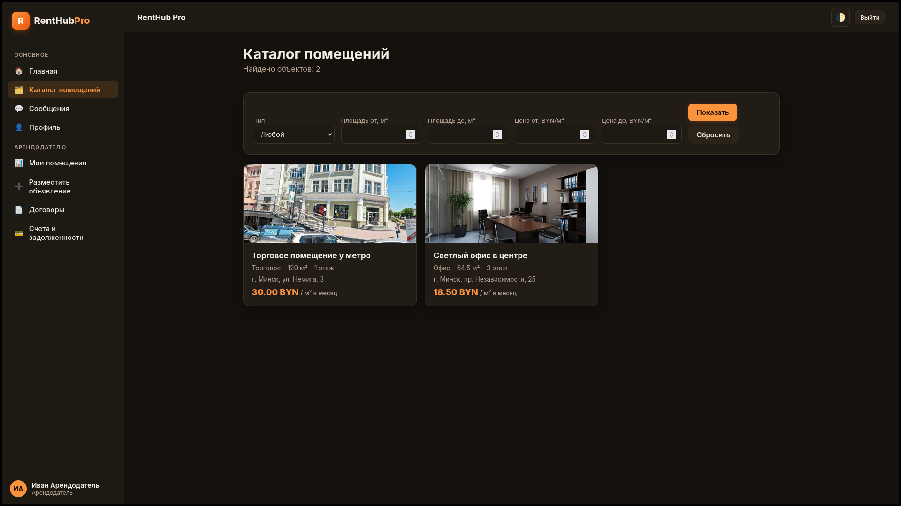
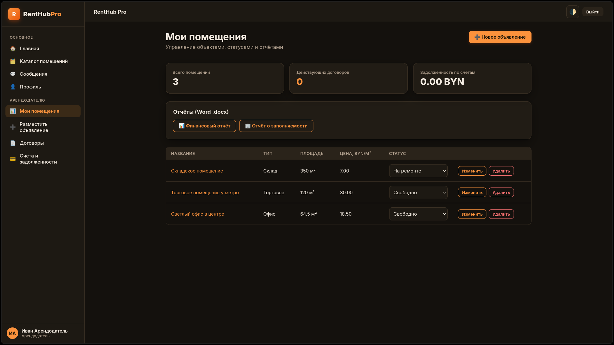
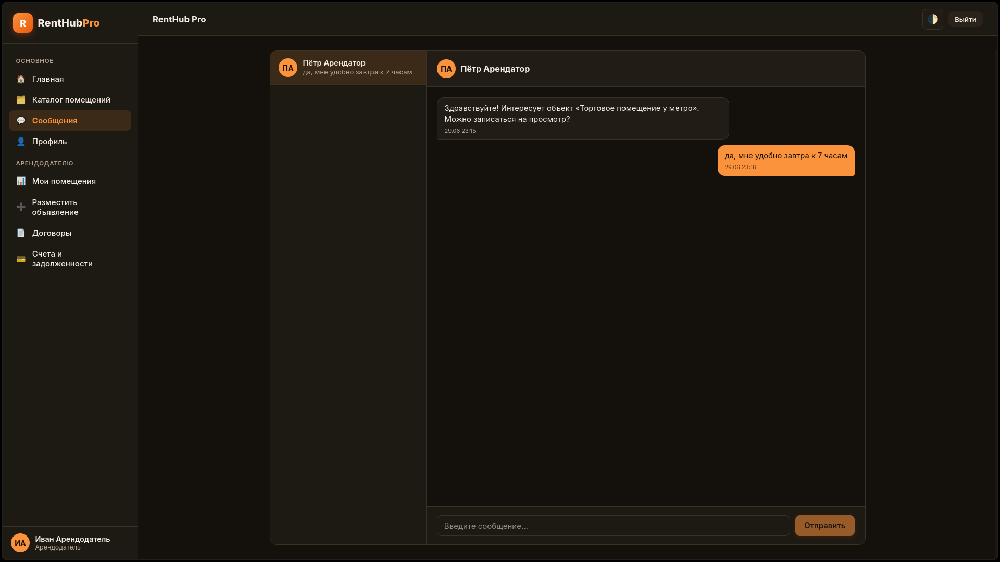
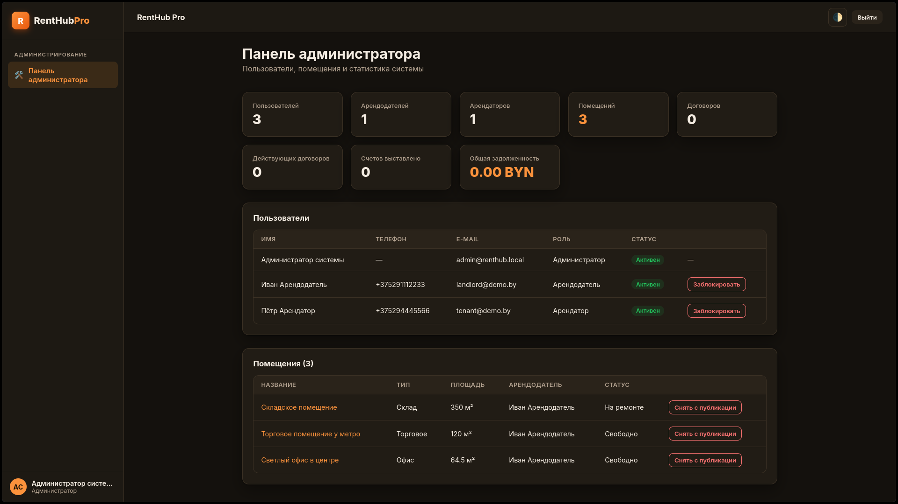

<div align="center">

# 🏢 RentHub Pro

### Веб-платформа для аренды коммерческих помещений

Каталог объектов, договоры, счета, отчёты и мгновенный чат — в одном приложении.

[](https://dotnet.microsoft.com/)
[](https://learn.microsoft.com/dotnet/csharp/)
[](https://dotnet.microsoft.com/apps/aspnet/web-apps/blazor)
[](https://learn.microsoft.com/ef/core/)
[](https://www.mysql.com/)
[](https://dotnet.microsoft.com/apps/aspnet/signalr)
[](#-лицензия)

</div>

---

## 📖 О проекте

**RentHub Pro** — это полнофункциональное веб-приложение для управления арендой коммерческой недвижимости (офисы, торговые, складские и производственные помещения). Система объединяет три роли пользователей — **арендодателя**, **арендатора** и **администратора** — и закрывает весь цикл аренды: от публикации объявления и подбора помещения до подписания договора, выставления счетов, загрузки чеков и формирования отчётов.

Проект построен на **ASP.NET Core Blazor (Interactive Server)** под **.NET 10**, использует **EF Core** (подход Code-First), **ASP.NET Core Identity** для аутентификации, **SignalR** для чата в реальном времени и **MySQL** в качестве СУБД.

---

## ✨ Возможности

### 👤 Арендодатель
| Функция | Описание |
|---|---|
| 🏠 Управление объявлениями | Создание, **редактирование** и удаление помещений, загрузка фотографий |
| 🔄 Статусы помещений | Доступно / Сдано / На ремонте с проверкой бизнес-правил |
| 📄 Договоры | Оформление, продление и расторжение договоров аренды |
| 💳 Счета | Выставление счетов, отметка об оплате, контроль задолженности |
| 🧾 Просмотр чеков | Просмотр чеков об оплате, загруженных арендатором |
| 📊 Отчёты | Финансовый отчёт и отчёт о заполняемости с выгрузкой в **Word (.docx)** |
| 💬 Чат | Переписка с арендаторами в реальном времени |

### 🧑‍💼 Арендатор
| Функция | Описание |
|---|---|
| 🗂️ Каталог | Поиск помещений с фильтрами по площади, типу и цене |
| ✍️ Подписание договоров | Подтверждение договоров, оформленных арендодателем |
| 📄 Мои договоры | Просмотр действующих, ожидающих подписания и завершённых договоров |
| 💳 Мои счета | История счетов и скачивание в формате документа |
| 📎 Чеки об оплате | Прикрепление файла-чека (изображение или PDF) к счёту |
| 💬 Чат | Связь с арендодателями в реальном времени |

### 🛡️ Администратор
| Функция | Описание |
|---|---|
| 👥 Пользователи | Просмотр и блокировка учётных записей **с указанием причины** |
| 🚫 Модерация объявлений | Снятие помещений с публикации с причиной и восстановление |
| 🔔 Уведомления | Оповещение, когда снятое объявление было изменено владельцем |
| 📈 Статистика | Сводные показатели по пользователям, помещениям, договорам и счетам |

### 🌐 Общее
- 🔐 **Ролевой доступ** на базе ASP.NET Core Identity и политик авторизации
- 🌓 **Тёмная и светлая темы** с сохранением выбора
- 📱 **Адаптивный интерфейс** (HTML / CSS / JavaScript)
- 🇧🇾 **Валидация телефонов** в формате `+375`
- ⚡ **Чат в реальном времени** на SignalR

---

## 🛠️ Технологический стек

| Категория | Технологии |
|---|---|
| **Язык** | C# 13 |
| **Платформа** | .NET 10, ASP.NET Core |
| **Frontend** | Blazor (Interactive Server), HTML5, CSS3, JavaScript |
| **База данных** | MySQL + Pomelo.EntityFrameworkCore.MySql |
| **ORM** | Entity Framework Core (Code-First, миграции) |
| **Аутентификация** | ASP.NET Core Identity |
| **Реальное время** | SignalR |
| **Отчёты** | DocumentFormat.OpenXml (генерация .docx) |

---

## 🚀 Быстрый старт

### Требования
- [.NET SDK 10.0](https://dotnet.microsoft.com/download)
- [MySQL 8.0+](https://dev.mysql.com/downloads/) (или MariaDB 10.11+)
- Инструмент `dotnet-ef`: `dotnet tool install --global dotnet-ef`

### 1. Клонирование
```bash
git clone <ссылка-на-репозиторий>
cd RentHubPro
```

### 2. Создание базы данных
```sql
CREATE DATABASE renthub_pro CHARACTER SET utf8mb4 COLLATE utf8mb4_unicode_ci;
CREATE USER 'renthub'@'localhost' IDENTIFIED BY 'renthub_pass';
GRANT ALL PRIVILEGES ON renthub_pro.* TO 'renthub'@'localhost';
FLUSH PRIVILEGES;
```
> Параметры подключения можно изменить в `appsettings.json`.

### 3. Применение миграций и запуск
```bash
dotnet restore
dotnet ef migrations add InitialCreate
dotnet run
```

Приложение само применит миграции и заполнит базу демонстрационными данными.
Откройте в браузере: **http://localhost:5000**

---

## 🔑 Демонстрационные учётные записи

| Роль | Логин (телефон) | Пароль |
|---|---|---|
| 🛡️ Администратор | `admin` | `Admin#2026!` |
| 👤 Арендодатель | `+375291112233` | `Demo#2026!` |
| 🧑‍💼 Арендатор | `+375294445566` | `Demo#2026!` |

---

## 🗂️ Структура проекта

```
RentHubPro/
├── Components/
│   ├── Account/          # Компоненты аутентификации
│   ├── Layout/           # Макет, навигация
│   └── Pages/            # Страницы приложения
├── Data/
│   ├── Entities/         # Сущности (Premise, Contract, Invoice, ...)
│   ├── ApplicationDbContext.cs
│   └── DbSeeder.cs       # Начальное заполнение данными
├── Hubs/
│   └── ChatHub.cs        # SignalR-хаб для чата
├── Services/             # Бизнес-логика (договоры, счета, отчёты, чат)
├── wwwroot/              # CSS, JavaScript, загруженные файлы
├── Program.cs            # Точка входа и конфигурация
└── appsettings.json
```

---

## 📸 Скриншоты

| Каталог | Панель арендодателя |
|---|---|
|  |  |

| Чат | Панель администратора |
|---|---|
|  |  |

---

## 📝 Лицензия

Проект распространяется под лицензией **MIT**. Подробнее — в файле `LICENSE`.

---

<div align="center">

⭐ Если проект оказался полезен — поставьте звезду!

</div>
